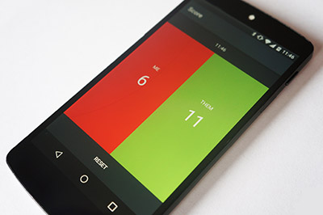
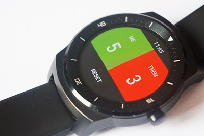

# Score counter
Count scores easily on your Android phone or Android Wear device.

Avoid arguments with friends, such as "4:3! Wait, isn't it 5:8? Oh, right, it was 5:7 just now .."!

## Screenshots

## TODO
Although this project should remain simple, there are several features that could be considered for future development: 
 
* saving current score (currently it disappears when app is restarted), 
* syncing score between phone and watch apps (i.e. changing the score on one side should change it on the other, as well), 
* saving past scores (e.g. have a button somewhere, which saves the current scores; and a list view for displaying them, along with the date and time, at which they were saved), 
* translations, 
* better icon (this should really be highest priority; any artist willing to help? :)).

## License
Available under the [MIT license](LICENSE).
